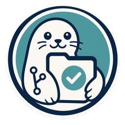

# RepoSeal

<p align="center">
  
</p>

[](https://github.com/R0k1e/RepoSeal/actions/workflows/ci.yml)
[](LICENSE)

**Seal every change with evidence.**

RepoSeal is an Agent-native GitHub Template for teams that want coding Agents to
work quickly without losing requirements, duplicating repository authorities,
overwriting parallel work, or delivering a green commit nobody can explain.

Use it when multiple coding Agents contribute to one repository, requirements
must remain traceable after chat context disappears, or repeated full-suite
testing is making parallel delivery unnecessarily slow.

It gives a repository one inspectable development lifecycle instead of relying
on chat history, an Agent's memory, or an unstructured collection of scripts.
The default branch is a rendered, clone-ready Template. A repository created
from it owns its copy and evolves independently; there is no upstream
synchronization contract. RepoSeal engine development stays on the `engine`
branch; the rendered Template carries only its reviewed, standard-library
lifecycle runtime and does not install the RepoSeal package.

## What it provides

| Outcome | Repository contract |
| --- | --- |
| Recorded requirements do not disappear silently | Every Review clause has exactly one approved Specification owner and an exhaustive Plan obligation. |
| Agents inspect before changing | Architecture and repository policy route discovery to named authorities and require an inspectable routing manifest. |
| Development feedback stays fast | Members run targeted or changed validation; complete validation runs once on the frozen batch. |
| Agent Teams work safely in parallel | Each member uses an isolated plan-owned worktree and cannot mutate the delivery worktree. |
| Every delivery is explainable | The delivery result names the requirements, Plans, member commits, validated batch tip, and delivery commit. |
| Tests protect product behavior | Unit tests cover pure contracts; integration tests traverse real public boundaries; implementation-detail assertions are rejected by policy. |
| Humans retain consequential decisions | Specification, architecture/process/security decisions, scope deferral, acceptance, and delivery remain explicit. |
| Failed workflows remain recoverable | The lifecycle avoids history rewriting and preserves evidence until remote delivery is confirmed. |

RepoSeal can mechanically prove coverage for requirements that were recorded,
the exact tree that was validated, and what entered a delivery. It cannot prove
that natural language was interpreted perfectly or that software is defect-free.

## The lifecycle

```text
Review -> Specification -> Plan -> isolated implementation
       -> member ready -> named batch -> final validation
       -> explicit delivery -> human acceptance or reopening
```

The repository exposes exactly eight non-interactive operations:

```text
workspace-open <branch> <base>
changed <base> [--explain]
ready <base>
batch-open --member <worktree-path> [--member <worktree-path> ...]
batch-admit <batch> --member <worktree-path> [--member <worktree-path> ...]
batch-continue <batch>
final
batch-deliver <source> <target> <expected-base> <expected-batch-tip>
```

`changed` is an optional diagnostic and `batch-continue` is conflict recovery.
The normal path is workspace, member closure, batch assembly, one frozen final
gate, and explicit delivery.

## Start here

1. Create a new repository with GitHub's **Use this template** action.
2. Follow [Quickstart](QUICKSTART.md) to complete one governed change.
3. Read [Development lifecycle](docs/concepts/development-lifecycle.md) for the
   boundary between Review, Specification, Plan, evidence, and acceptance.
4. Use [Agent Team delivery](docs/workflows/agent-team-delivery.md) for parallel
   members and batch delivery.
5. Read [Customizing the Template](docs/guides/customizing-the-template.md)
   before changing repository authorities.

See the [documentation map](docs/README.md), [why RepoSeal exists](docs/product/why-reposeal.md),
and [frequently asked questions](docs/product/frequently-asked-questions.md)
for evaluation and comparison. If you already use a specification tool, read
[RepoSeal and specification tools](docs/product/reposeal-and-specification-tools.md).

A complete, non-authoritative teaching artifact is available under
[`examples/complete-change`](examples/complete-change/README.md).

## Validate the Template

```bash
uv sync --locked
uv run reposeal check product-surface --repository .
uv run reposeal check traceability --repository .
uv run pytest
uv build
```

The `reposeal` CLI emits one JSON result and exits nonzero for invalid
contracts. RepoSeal is both the product and machine protocol identity. See
[Architecture](docs/ARCHITECTURE.md) for current responsibility boundaries.

## Project boundaries

- This is a development lifecycle Template, not an Agent runtime or hosted
  service.
- It does not update repositories previously created from it.
- It does not replace product-specific architecture, tests, or human review.
- Validation is check-only. Publication and delivery require explicit authority.

See [Contributing](CONTRIBUTING.md), [Security](SECURITY.md),
[Changelog](CHANGELOG.md), and the [Apache-2.0 license](LICENSE).
Maintainers should follow the [release guide](docs/maintainers/releasing.md)
before creating a version tag or publishing artifacts.
